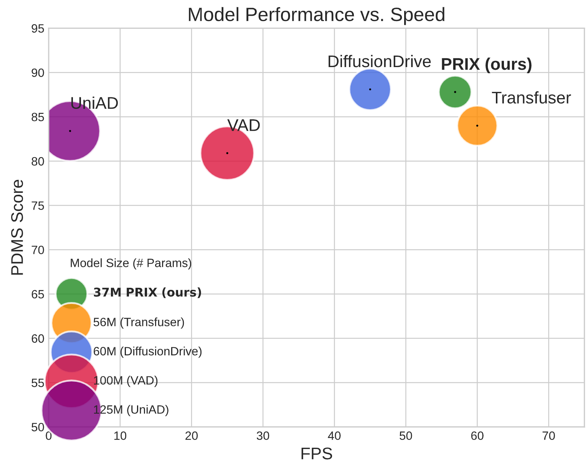
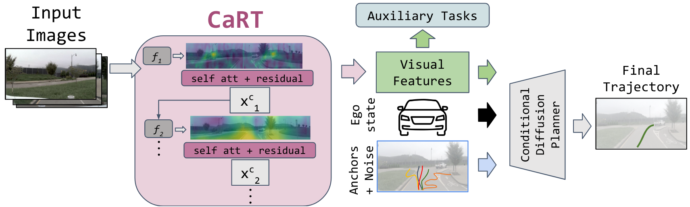
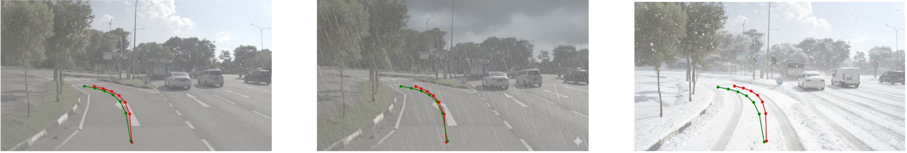

<div align="center">

<h1>PRIX</h1>
<h3>Learning to Plan from Raw Pixels for End-to-End Autonomous Driving</h3>

[Maciej Wozniak](https://maxiuw.github.io/)<sup>1</sup>, [Lianhang Liu](https://scholar.google.com/)<sup>1,2</sup>, [Yixi Cai](https://scholar.google.com/)<sup>1 *</sup>, [Patric Jensfelt](https://scholar.google.com/)<sup>1</sup>
 
<sup>1</sup> Robotics Perception and Learning Department, KTH Royal Institute of Technology
<sup>2</sup> SCANIA, Stockholm, Sweden
(<sup>*</sup>) corresponding author, yixica@kth.se 

Accepted to IEEE Robotics and Automation Letters (RA-L) 2026! 

[](https://maxiuw.github.io/prix)&nbsp;
[](https://maxiuw.github.io/prix)&nbsp;

</div>

## News
* **` Mar. 3rd, 2026`:** PRIX is accepted to IEEE Robotics and Automation Letters (RA-L)
* **` Nov. 19th, 2025`:** Initial manuscript submitted for review

## Table of Contents
- [Introduction](#introduction)
- [Methodology](#methodology)
- [Qualitative Results](#qualitative-results)
- [NavSim Setup](#navsim-setup)
- [Results & Benchmarks](#results--benchmarks)
- [Contact](#contact)
- [Acknowledgement](#acknowledgement)
- [Citation](#citation)

## Introduction
PRIX (Plan from Raw pIXels) is an efficient end-to-end autonomous driving model designed to operate exclusively on camera data. By eliminating the reliance on expensive LiDAR sensors and computationally heavy Bird's-Eye View (BEV) representations, PRIX addresses the scalability limitations of current mass-market vehicles. 

The architecture achieves a state-of-the-art balance between performance and speed, reaching **87.8 PDMS** on NavSim-v1 while maintaining a real-time inference speed of **57 FPS** on consumer-grade hardware.

<div align="center">
<b>Model Performance vs. Speed on NavSim-v1.</b>

</div>

## Methodology
The core of PRIX is the **Context-aware Recalibration Transformer (CaRT)**, which enhances visual features by modeling long-range dependencies across the spatial domain without explicit 3D geometry. These refined features are then utilized by a **Conditional Diffusion Planner**. This planner treats trajectory prediction as a denoising process, using a vocabulary of trajectory anchors to refine noisy proposals into safe, feasible paths in just 2 steps.

<div align="center">
<b>PRIX Architecture Overview.</b>

</div>

## Qualitative Results
PRIX demonstrates robust planning capabilities in complex urban environments, safely navigating busy intersections and maintaining performance during adverse weather conditions such as rain and snow.

<div align="center">
<b>Robustness in Snow and Rain.</b>

</div>

## Installation

### 1. Base Environment (NAVSIM)
PRIX is built on the NAVSIM framework. You must first install the NAVSIM devkit and its dependencies (refer to Navsim repo for that).

We also provide environment.yml and requirements.txt file with dependencies. 

We recommend using conda and after setting up correct conda env

`conda env create --file environment.yml`

`conda activate prix`

`pip install -r requirements.txt`


## NavSim Setup
Evaluation is primarily conducted using the **NavSim** framework:
* **NavSim-v1**: Benchmarked in a non-reactive simulation where the agent plans a 4-second trajectory from initial sensor data. Performance is aggregated into the PDM Score (PDMS), which penalizes safety failures while rewarding progress and comfort.
* **NavSim-v2**: Utilizes pseudo-simulation with reactive traffic, measured by the Extended PDM Score (EPDMS).
* **Training**: Models are trained for 100 epochs with a per-GPU batch size of 64 using the AdamW optimizer.

## Results & Benchmarks

### NavSim-v1 Performance
| Method | Input | Backbone | PDMS ↑ | FPS ↑ |
| :--- | :---: | :---: | :---: | :---: |
| UniAD | Camera | ResNet-34 | 83.4 | 3 |
| Transfuser | C & L | ResNet-34 | 84.0 | 60 |
| DiffusionDrive | C & L | ResNet-34 | 88.1 | 45 |
| **PRIX (ours)** | **Camera** | **ResNet-34** | **87.8** | **57** |

### nuScenes Trajectory Prediction
| Method | Input | L2 (m) Avg ↓ | Collision Rate (%) ↓ | FPS ↑ |
| :--- | :---: | :---: | :---: | :---: |
| VAD | Camera | 0.72 | 0.22 | 4.5 |
| SparseDrive | Camera | 0.61 | 0.08 | 9.0 |
| **PRIX (ours)** | **Camera** | **0.57** | **0.07** | **11.2** |

## Contact
For questions regarding the paper or implementation, please contact **Maciej Woznia** (maciejw@kth.se) or **Yixi Cai** (yixica@kth.se).

## Acknowledgement
This work was supported by the **Wallenberg AI, Autonomous Systems and Software Program (WASP)**. We also acknowledge the use of the NavSim-v1 and nuScenes benchmarks in our evaluation.

## Citation
```bibtex
@article{wozniak2026prix,
  title={PRIX: Learning to Plan from Raw Pixels for End-to-End Autonomous Driving},
  author={Wozniak, Maciej and Liu, Lianhang and Cai, Yixi and Jensfelt, Patric},
  journal={IEEE Robotics and Automation Letters},
  year={2026},
  publisher={IEEE}
}